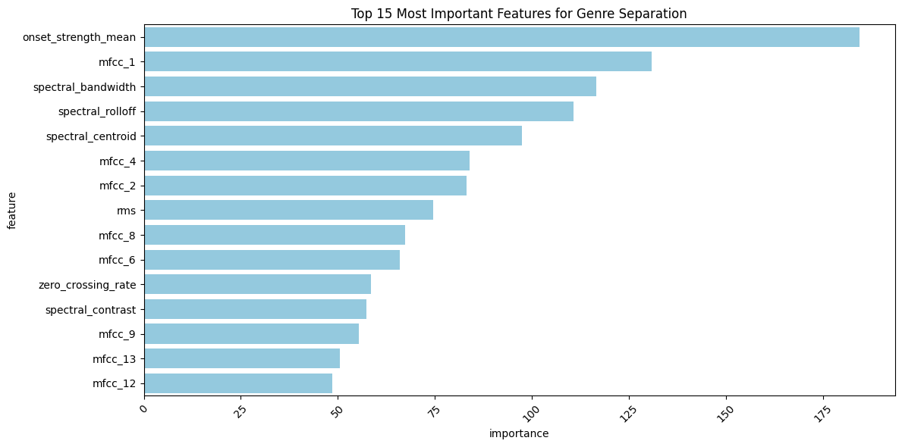

# 🎵 Music Genre Classification

This section presents our attempt to create a baseline model for music genre classification.  
We implement machine learning models to classify music genres based on audio features.  
The models can distinguish between **10 different genres**:  
**Blues, Classical, Country, Disco, Hip-hop, Jazz, Metal, Pop, Reggae, and Rock**.

---

## 🚀 Models & Performance
### 30 seconds audios results
| Model         | Macro F1 | Accuracy | Best Performing Genres (F1)     | Challenging Genres (F1) |
|--------------|----------|----------|---------------------------------|--------------------------|
| **Random Forest** | **0.75** | **0.76** | Metal (0.88), Pop (0.88), Reggae (0.81) | Country (0.56), Rock (0.61) |
| **XGBoost**  | **0.73** | **0.73** | Metal (0.90), Pop (0.90), Classical (0.77) | Rock (0.65), Country (0.56) |
| **SVM (RBF)** | **0.57** | **0.57** | Classical (0.85), Metal (0.82) | Disco (0.38), Rock (0.39) |
| **Stacking** | **0.61** | **0.62** | Metal (0.82), Classical (0.80) | Rock (0.28), Hip-hop (0.43) |

### 1 second audios results
| Model         | Macro F1 | Accuracy | Best Performing Genres (F1)     | Challenging Genres (F1) |
|--------------|----------|----------|---------------------------------|--------------------------|
| **Random Forest** | **0.79** | **0.79** | Classical (0.88), Metal (0.83), Hip-hop (0.82) | Country (0.73), Disco (0.73) |
| **XGBoost**  | **0.80** | **0.80** | classical (0.90), Metal (0.89), Pop (0.86) | Disco (0.73), Rock (0.68) |
| **SVM (RBF)** | **0.74** | **0.74** | Classical (0.89), Metal (0.82) | Disco (0.66), Rock (0.62) |
| **Stacking** | **0.65** | **0.65** | Classical (0.88), Metal (0.76) | Country (0.53), Rock (0.43) |

**Key Findings**:<br>
1️⃣ 30 seconds audios  
🌚 **Random Forest** achieves the highest **F1-score (0.75)** and most consistent results.  
🌚 **XGBoost** performs similarly but has higher variance across genres.  
⚠️ **Rock & Country** are the hardest to classify.  
🎸 **Metal & Pop** are the most reliably classified across models.<br>
2️⃣ 1 second audios<br>
🌚 **XGBoost** achieves the highest **F1-score (0.80)** and most consistent results.<br>
⚠️ **Rock & Disco** are the hardest to classify.  
🎸 **Classical & metal** are the most reliably classified across models.<br>
🧠Conclusion<br> 
Models using 1 seconds audio achieves higher results.

---

## 🧠 Approach  

We experimented with two feature selection approaches:  
1️⃣ **Full Feature Set**: Using all available features.  
2️⃣ **Top 8 Features**: Selected based on **F-scores** for improved efficiency.



🔹 **Note:** While dimensionality reduction wasn't necessary due to the limited feature set,  
we included this step to highlight its importance in real-world scenarios.

---

## 🗂 Dataset  

We use the **same dataset** as the one used for our **Deep Learning models**.

---

## 📊 Performance Metrics  

To evaluate our models, we use:  
✔ **Macro-averaged F1-score**  
✔ **Per-class precision & recall**  
✔ **Confusion matrix analysis**  

---

## 📦 Requirements  

Ensure you have the following dependencies installed:  

```bash
pip install numpy pandas scikit-learn xgboost seaborn matplotlib
```

---

## 📝 Files  

| File | Description |
|------|------------|
| **models.ipynb** | Model training & evaluation |
| **EDA_num.ipynb** | Exploratory Data Analysis (numerical features) |
| **music_features_scaled.csv** | Scaled dataset with all features |
| **top_features_scaled.csv** | Dataset with selected important features |
| **experimentation_1sec/** | Directory containing files of 1sec audios analysis and models |

🔹 **Files that are not critical for final results**:  
- **EDA_specs.ipynb**: Spectrogram analysis.  
- **EDA.ipynb**: Initial exploratory data analysis.

---

## 🔮 Future Improvements  

📌 **Data Augmentation** to improve model generalization.  
📌 **Deep Learning models** for enhanced feature extraction.  
📌 **Hyperparameter Optimization** for better tuning.  

---

